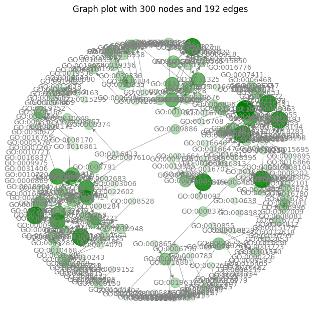
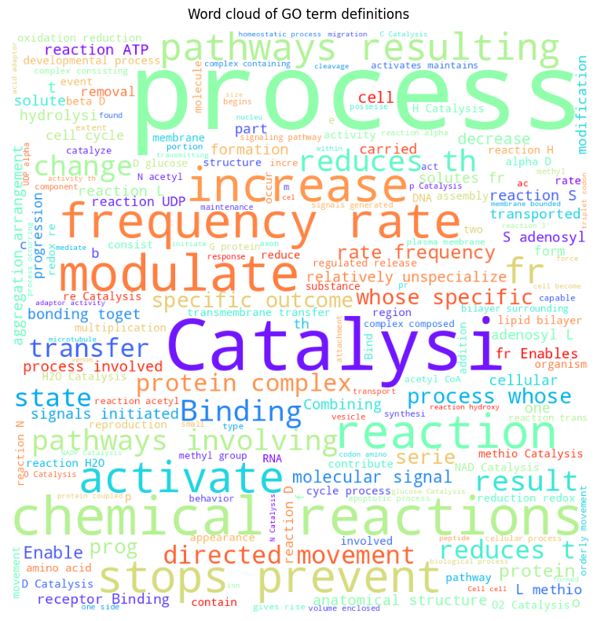

# Fine-Tuning Text Transformers with Gene Ontology Annotations: A Case Study

This repository demonstrates the use of text definitions of Gene Ontology (GO) terms to fine-tune a pre-trained Large Language Model (LLM), specifically Bidirectional Encoder Representations from Transformers (BERT), based on the transformer architecture. The goal of this exercise is to leverage the LLM to categorize GO term definitions based on their alignment with the major GO ontologies: *Biological Process*, *Cellular Component*, and *Molecular Function*.

In addition to utilizing GO term definitions as a "toy" dataset for practicing fine-tuning LLMs, this exercise aims to extract hidden dependencies among manually annotated GO term definitions. One potential application for the model is classifying molecular biology texts based on their emphasis on specific GO aspects.

For further details about BERT, you can refer to the [official documentation](https://huggingface.co/docs/transformers/model_doc/bert).

## Clone Repository

```shell
(base)$ git clone https://github.com/matiollipt/GO-graph-definition-text-transformer.git
```

## Configure Conda Environment

- Creating the environment

```shell
(base)$: conda env create -f environment.yml
```

- Activating the environment

```shell
(base)$: conda activate go_tune
```

- Running the notebook

```shell
(go_tune)$: python -m jupyter main.ipynb
```

## Introduction

**Transformers** have gained significant attention in the Natural Language Processing (NLP) and machine learning landscape, contributing to the development of generative models like [chatGPT](https://chat.openai.com). Text transformer-based architectures are specifically engineered to analyze the dependencies between words (or *tokens*) in a text sequence, considering their positions to accuratelly capture the meaning of the text. This capability is instrumental in tasks such as text classification and ranking, as well as enabling generative models to generate new sentences in response to prompts.

<figure>
  <p align="center">
    
  </p>
</figure>

The transformer architecture can be adapted and trained for more specific applications, such as [ProteinBERT](https://doi.org/10.1093/bioinformatics/btac020). ProteinBERT builds upon the efficient transformer architecture and is trained on over 106 million protein sequences from [UniProt](https://www.uniprot.org/) to capture protein semantics. The pre-trained model can then be fine-tuned to classify proteins into families, identify phylogenetic relationships, predict protein function and subcellular localization, and anticipate protein-protein interactions, among other interesting applications for protein embeddings.

## Automating Discovery In Life Sciences

High-throughput [DNA sequencing](https://en.wikipedia.org/wiki/DNA_sequencing#High-throughput_sequencing_(HTS)_methods) has give us the power to sequence the entire genome of a species within a day. With the sequence on hands, we can deploy **computational models to identify and annotate genes** based on their characteristics, attributing correct functions and subcellular locations of the gene product given the gene sequence.

For example, the [Critical Assessment of Protein Function Annotation (CAFA)](https://www.cell.com/trends/genetics/fulltext/S0168-9525(13)00166-2) competition engages the data science community in enhancing protein prediction by utilizing features derived from [Gene Ontology (GO)](https://geneontology.org/docs/ontology-documentation/).

## The Gene Ontology Graph

The Gene Ontology is represented as a **directed acyclic graph (DAG**) where **each node represents a specific GO term**. Each GO term defines a particular aspect of genes and their products. 

The GO terms are organized into **three main aspects**:

- <font color="grey">***Molecular Function (MF)***</font>: These terms define the **activities** performed by gene products, such as *catalysis* or *transport*. These functions can be further refined by more specific GO terms, for example, "protein kinase activity" within the broader category of "catalysis".

- <font color="grey">***Cellular Component (CC)***</font>: These terms specify the subcellular **locations** of gene products, including compartments like *chloroplast* or *nucleus*, as well as macromolecular complexes like *proteasome* or *ribosome*.

- <font color="grey">***Biological Process (BP)***</font>: These terms delineate the biological **pathways** in which gene products are involved, ranging from 'DNA repair' and 'carbohydrate metabolic process' to overarching processes like *biosynthetic processes*.

The relationships between these terms are **hierarchical**, with **parent-child relationships** indicating broader and more specific terms, respectively. This hierarchical structure allows researchers to **annotate genes and gene products**, providing valuable information about their functions and roles in biological processes. For more information about how the GO graph is structured, please refer to my previous post [GO-graph-EDA](https://github.com/matiollipt/GO-graph-EDA) and the [Gene Ontology reference](https://geneontology.org/docs/ontology-documentation). For now, it is essential to know that **each node representing a GO term has specific attributes**.

## Extracting GO terms definitions

A feature often overlooked when deploying the GO graph to assist in the prediction and classification of gene functions is the **textual definition of each GO term**. For example, the GO term ID [GO:0015986](https://www.ebi.ac.uk/QuickGO/term/GO:0015986) is defined as *"The transport of protons across the plasma membrane to generate an electrochemical gradient (proton-motive force) that powers ATP synthesis."*, along with other attributes shown below:

---
 **GO id**: GO:0015986

- **name**: 'proton motive force-driven plasma membrane ATP synthesis'
- **namespace**: 'biological_process'
- **def**: '"The transport of protons across the plasma membrane to generate an electrochemical gradient (proton-motive force) that powers ATP synthesis." [GOC:mtg_sensu, ISBN:0716731363]'
- **synonym**: ['"ATP synthesis coupled proton transport" BROAD []', '"plasma membrane ATP synthesis coupled proton transport" EXACT []']
 - **is_a**: ['GO:0015986']}

 ---
The nodes contain attributes describing the corresponding GO terms, and these are the essential ones that appear in every node:

- ***name***: unique identifier of the term in a human-readable format
- ***namespace***: one of the three major ontologies (MF, CC or BP) to which the term belongs
- ***definition***: a short description of what the GO term means for humans. It can also contains references to publications defining the term (e.g. PMID:10873824).

In this exercise, we use the GO terms' definitions to fine-tune a LLM as a text classifier of GO aspects.

>**Fine-tuning** is a powerful technique in machine learning that involves using models that have undergone **semi-supervised training** on extensive data from various sources. This process imparts the model with underlying semantic features of the language. After pre-training, the model is further trained in a **supervised manner** for a specific task, such as text generation, classification, or label prediction (for instance, identifying whether emails are spam or not). During this phase, the deeper encoded features of the pre-trained model are retained, but the trainable parameters of the output layer(s) are adjusted. For example, a feed-forward neural network followed by a softmax function can be added for binary classification of "spam" vs "not spam." These steps embody the concept of [Transfer Learning](https://machinelearningmastery.com/transfer-learning-for-deep-learning/), a powerful machine learning technique that involves applying knowledge learned from one task effectively to another task.

### Dataset Preparation

Our initial step involves pre-processing the dataset to make it compatible with the pre-trained model that we are going to fine-tune according to our needs. The BERT model has previously undergone **semi-supervised training** on an extensive dataset comprising millions of entries from [Wikipedia](https://www.wikipedia.org/) in 102 different languages. During this pre-training phase, the model learns language rules and dependencies, setting the stage for its application in various **supervised training** scenarios. These applications include tasks like sentiment analysis, text generation, text sequence classification, and, in our specific case, identifying the major GO ontology categories (BP, CC, and MF) for the given text sequences.

To prepare the dataset for fine-tuning our model, we will perform the following tasks:

1. **Feature Extraction**: In this step, we convert the attributes associated with each GO term's nodes into a Pandas DataFrame. This conversion streamlines the creation of pre-processed and tokenized datasets that will be used to train the model. We will focus on extracting only the text definitions and labels corresponding to the aspects we aim to predict (BP, MF, and CC).

2. **Dataset Creation and Splitting**: Our data will be divided into two subsets: a training set (80%) and an test set (20%). These sets will contain the input text derived from the definitions of GO terms.

3. **Text Tokenization**: The input text undergoes a tokenization process, breaking it into smaller units known as tokens. Special tokens are also incorporated to indicate the start and end of sequences and sentences. This step is crucial for enabling the model to comprehend the text.

To create and manage these datasets, we will make use of the [Dataset](https://huggingface.co/docs/datasets/index) library provided by Hugging Face. Additionally, as our project progresses, we will leverage pre-trained sequence classification models and their corresponding tokenizers, which are also available from [Hugging Face](https://huggingface.co/).

### Feature Extraction

The GO graph is stored in the *OBO (Open Biomedical Ontologies) file format*, designed specifically for the construction and representation of biological ontologies. To convert this file format into a **NetworkX** object, we can utilize the Python library [obonet](https://github.com/dhimmel/obonet). [NetworkX](https://networkx.org/) offers a robust framework for graph manipulation and analysis.

```python
from obonet import read_obo

go_graph = read_obo(home_dir.joinpath("data/go-basic.obo"))
```
We can use the convenience function `plot_graph()` to visualize a subset of GO graph nodes and how they are connected. Here, I selected the nodes with the **highest degrees** to plot. For further details about nodes' degrees, please refer to my previous post [GO-graph-EDA](https://github.com/matiollipt/GO-graph-EDA).

<figure>
  <p align="center">
    
  </p>
</figure>

The next step involves **extracting information from nodes in the GO graph and structuring it into a dataframe** to streamline the handling of text definitions. We also obtain the number of words to choose the maximum length for input during training and evaluation. Shorter inputs reduce the training time and computational requirements a great deal.

During this extraction process, we intend to focus on the textual description from the definitions, which is stored in a specific format. Each node in the GO graph has an ID and a dictionary containing various attributes, including the definition. For example:

```
('GO:0000001', {'name': 'mitochondrion inheritance', 'namespace': 'biological_process', 'def': '"The distribution of mitochondria, including the mitochondrial genome, into daughter cells after mitosis or meiosis, mediated by interactions between mitochondria and the cytoskeleton." [GOC:mcc, PMID:10873824, PMID:11389764]', 'synonym': ['"mitochondrial inheritance" EXACT []'], 'is_a': ['GO:0048308', 'GO:0048311']})
```

There are many ways to create dataframes from other types of unstructured or structured data. The code snippet below does the job and saves the dataframe:


```python
# create GO definitions dataframe

# create empty dataframe to store nodes' attributes
go_df = pd.DataFrame(
    columns=["go_id", "name", "aspect", "definition", "def_word_count"]
)

# iterate over nodes to extract dictionary keys and values
n_rows = len(go_graph.nodes)

for idx, item in tqdm(enumerate(go_graph.nodes.items()), total=n_rows):
    go_term = item[0]
    name = item[1]["name"]
    aspect = item[1]["namespace"]

    # split 'def' content and get the text definition only
    definition = item[1]["def"].split(sep='"', maxsplit=2)[1]

    # count the number of words of the text we just extracted
    def_word_count = len(re.findall(r"\w+", definition))

    go_df.loc[idx] = [
        go_term,
        name,
        aspect,
        definition,
        def_word_count,
    ]

# save dataframe
home_dir.joinpath("data/").mkdir(parents=True, exist_ok=True)
go_df.to_csv(home_dir.joinpath("data/go_df.csv"), index=False)
```

Before proceeding, we will make some modifications in our dataset: renaming the **definition** column to *text*, and converting the **aspect** column to a **categorical data type** while mapping the aspects to numeric labels and keeping only these two columns for the downstream tasks:

```python
# loading saved dataframe with GO graph nodes' attributes

# load saved GO dataframe
go_df = pd.read_csv(home_dir.joinpath("data/go_df.csv"))

# convert categorical labels to numbers (aspect)
go_df["aspect"] = pd.Categorical(go_df["aspect"])

# get categorical codes
go_df["label"] = go_df["aspect"].cat.codes

# select only relevant columns
data = go_df[["definition", "label"]].copy()

# rename definition column
data.rename(columns={"definition": "text"}, inplace=True)

print(f"Dataset dimensions: {data.shape}")
display(data.head())

# print label mapping for reference
print("\nCode: label")
for code, aspect in enumerate(go_df.aspect.cat.categories):
    print(f"{code}: {aspect}")
```
We can visualize the most common terms in the dataset by creating a [word cloud](http://amueller.github.io/word_cloud/). This visual representation is quite helpful in identifying the most frequently occurring words in a given text.

```python
from wordcloud import WordCloud

go_wordcloud = WordCloud(
    width=800,
    height=800,
    background_color="white",
    min_font_size=10,
    colormap="rainbow",
    random_state=13,
).generate(data.text.to_string())

plt.figure(figsize=(8, 8), facecolor=None)
plt.suptitle("Word cloud of GO term definitions")
plt.imshow(go_wordcloud)
plt.axis("off")
plt.tight_layout(pad=1)
plt.show()
```

Below, we can clearly see that life is all about a system of **controled catalysis**, and the information encoded in the genomes allows such organized system to be passed forward:

<figure>
  <p align="center">
    
  </p>
</figure>

### Dataset Creation and Splitting

To construct the dataset containing our text sequences and corresponding labels for fine-tuning the model, we will leverage the [Dataset](https://huggingface.co/docs/datasets/package_reference/main_classes#datasets.Dataset) class provided by Hugging Face. Using its built-in dataset split method, we will create distinct training and testing sets. We will ensure that the sampling is **stratified by label**. This stratification is crucial as it **preserves the distribution of the GO ontologies**, ensuring a representative balance in our datasets.


```python
from datasets import Dataset

# create dataset
dataset = Dataset.from_pandas(data)

# change label column to ClassLabe to allow stratification
dataset = dataset.class_encode_column("label")

# split the dataset into train (80%) / test (20%)
dataset = dataset.train_test_split(test_size=0.2, stratify_by_column="label")
```
The resulting dataset is nested dictionary containing both sets and the GO term definitions with the respective labels:
```
DatasetDict({
    train: Dataset({
        features: ['text', 'label'],
        num_rows: 34598
    })
    test: Dataset({
        features: ['text', 'label'],
        num_rows: 8650
    })
})
```

### Text Tokenization

The **tokenization strategy must align with the chosen model**. This is crucial to ensure that tokens are mapped to the **same indices** presented to the model during training and that the **same special tokens** are used to denote the beginning of a text sequence and the separation between sentences. We also need to handle inputs that are longer or shorter than the input accepted by the model, or defined by us when we initialize the tokenizer.

> **Handling text input length with truncation and padding strategy**: The model accepts fixed-sized tensors for training and evaluation. To ensure that we feed the model with fixed-sized tensors, the tokenizer handle sequences of varying lengths by truncating and padding longer and shorter text sequences, respectively. If the *truncation* parameter is set to 'True,' input sequences longer than a defined length will be truncated. Conversely, if the sequences are shorter, the special padding token [PAD] will be added until the number of tokens in the input matches our requirements for the model of choice. Truncation and padding are pivotal in guaranteeing consistent input sizes, as the inputs for the model we chose are predefined fixed-size tensors (e.g., 510 tokens + 2 special tokens [CLS] and [SEP] = 512). For our **fine-tunning** task, setting the input maximum length to 150 tokens encompass the majority of the samples and expedite the tokenization process.

**Classification Token [CLS]** and **Separator Token [SEP]** are special tokens that provide information about the input provided to the model we choose. [CLS] marks the initiation of the sequence for the BERT model. [SEP] separates sentences in sentence-pair tasks. It aids the model in capturing the relationships between two sentences that are concatenated using [SEP]. Note the use of padding [PAD] to fill-up the input sequence to a fixed length. 

In this context, we are employing the [BertTokenizerFast](https://huggingface.co/docs/transformers/model_doc/bert#transformers.BertTokenizerFast) with the tokenization strategy of the pre-trained model [bert-base-multilingual-uncased](https://huggingface.co/bert-base-multilingual-uncased) to convert text to lowercase and eliminate capitalization. Lowercase inputs typically result in a smaller number of tokens and tend to generalize better for unseen text sequences during production phase. However, we can later explore the possibility of using cased inputs to evaluate model performance.

As indicated by the boxplot above, all GO term definitions conform to the input size requirements for fine-tuning (510 tokens). Nonetheless, we might consider limiting the input length to expedite the fine-tuning process. To proceed, we will create the dataset with training and test sets using Hugging Face's Dataset library. We will employ stratification to maintain the distribution of labels between datasets.

```python
from transformers import BertTokenizerFast

# initiate tokenizer with parameters from the pre-trained model
tokenizer = BertTokenizerFast.from_pretrained("bert-base-multilingual-uncased")


# define tokenize function to be applied to the input (lowercase is applied by default)
def tokenize_function(examples):
    return tokenizer(examples["text"], padding=True, max_length=100, truncation=True)


# tokenize dataset
tokenized_dataset = dataset.map(tokenize_function, batched=True)
```
Now, our dataset contains additional stuff that will be fed to the model during training:

```
DatasetDict({
    train: Dataset({
        features: ['text', 'label', 'input_ids', 'token_type_ids', 'attention_mask'],
        num_rows: 34598
    })
    test: Dataset({
        features: ['text', 'label', 'input_ids', 'token_type_ids', 'attention_mask'],
        num_rows: 8650
    })
})
```
Let's see what are these new features created by the tokenizer by cheking the first sample from the train dataset:

```python
print("text:", tokenized_dataset["train"]["text"][0])
print("label:", tokenized_dataset["train"]["label"][0])
print("input_ids:", tokenized_dataset["train"]["input_ids"][0])
print("token_type_ids:", tokenized_dataset["train"]["token_type_ids"][0])
print("attention_mask:", tokenized_dataset["train"]["attention_mask"][0])
```

```
text: The aggregation, arrangement and bonding together of a set of components to form a virus tail fiber.

label: 0

input_ids: [101, 10103, 13353, 37910, 69649, 117, 34429, 10110, 19600, 10285, 13627, 10108, 143, 10486, 10108, 32383, 10114, 11857, 143, 17890, 34365, 75351, 119, 102, 0, 0, 0, 0, 0, 0, 0, 0, 0, 0, 0, 0, 0, 0, 0, 0, 0, 0, 0, 0, 0, 0, 0, 0, 0, 0, 0, 0, 0, 0, 0, 0, 0, 0, 0, 0, 0, 0, 0, 0, 0, 0, 0, 0, 0, 0, 0, 0, 0, 0, 0, 0, 0, 0, 0, 0, 0, 0, 0, 0, 0, 0, 0, 0, 0, 0, 0, 0, 0, 0, 0, 0, 0, 0, 0, 0]

token_type_ids: [0, 0, 0, 0, 0, 0, 0, 0, 0, 0, 0, 0, 0, 0, 0, 0, 0, 0, 0, 0, 0, 0, 0, 0, 0, 0, 0, 0, 0, 0, 0, 0, 0, 0, 0, 0, 0, 0, 0, 0, 0, 0, 0, 0, 0, 0, 0, 0, 0, 0, 0, 0, 0, 0, 0, 0, 0, 0, 0, 0, 0, 0, 0, 0, 0, 0, 0, 0, 0, 0, 0, 0, 0, 0, 0, 0, 0, 0, 0, 0, 0, 0, 0, 0, 0, 0, 0, 0, 0, 0, 0, 0, 0, 0, 0, 0, 0, 0, 0, 0]

attention_mask: [1, 1, 1, 1, 1, 1, 1, 1, 1, 1, 1, 1, 1, 1, 1, 1, 1, 1, 1, 1, 1, 1, 1, 1, 0, 0, 0, 0, 0, 0, 0, 0, 0, 0, 0, 0, 0, 0, 0, 0, 0, 0, 0, 0, 0, 0, 0, 0, 0, 0, 0, 0, 0, 0, 0, 0, 0, 0, 0, 0, 0, 0, 0, 0, 0, 0, 0, 0, 0, 0, 0, 0, 0, 0, 0, 0, 0, 0, 0, 0, 0, 0, 0, 0, 0, 0, 0, 0, 0, 0, 0, 0, 0, 0, 0, 0, 0, 0, 0, 0]
```

Each feature holds specific information relevant to the tokenized dataset:

- **text**: the input text sequence.
- **label**: numerical values corresponding to the classes (i.e. ontologies) to predict:
  - 0: biological_process
  - 1: cellular_component
  - 2: molecular_function
- **input_ids**: These are the indices of each token within the sequence. These indices were generated during the model's pre-training phase and are now applied to our input.
- **token_type_ids**: This feature provides references to the sentence to which each token belongs.
- **attention_mask**: It indicates whether the token should be attended to during processing.

## Fine-Tuning the Model

Continuing our progress, we will initialize the [BertForSequenceClassification](https://huggingface.co/docs/transformers/v4.33.2/en/model_doc/bert#transformers.BertForSequenceClassification) model and load the **weights** from the [pre-trained model](https://huggingface.co/bert-base-multilingual-uncased). Additionally, we will specify the number of target labels we aim to predict. In our case, we intend to classify whether the text corresponds to Biological Process (label = 0), Cellular Component (label = 1), or Molecular Function (label = 2). Consequently, the number of labels is set to **3**.

It's crucial to recognize that training Large Language Models can be computationally intensive, often demanding substantial hardware resources. The model we are utilizing consists of **168 million trainable parameters**, pre-trained in a semi-supervised manner. While we won't be training all of these parameters, but only a subset for our specific task, it remains a significant computational task.

>The **carbon footprint** of such large language models can be quite taxing. An additional important benefit of fine-tunning is reducing the carbon footprint when deploying custom models. This [interesting seminar](https://www.youtube.com/watch?v=_6R7Ym6Vy_I) from [The Royal Institution](https://youtube.com/@TheRoyalInstitution?si=_eU1H86ZJxwWbyqj) YouTube channel talks about it.

Depending solely on a CPU for training and fine-tuning may lead to lengthy and impractical processing times. 

>Hugging Face's [Trainer](https://huggingface.co/docs/transformers/v4.29.0/en/main_classes/trainer#transformers.Trainer) seamlessly handles model and data allocation between devices. If a GPU is available and correctly configured in the system, the Trainer class will utilize it.

```python
from transformers import BertForSequenceClassification

model = BertForSequenceClassification.from_pretrained(
"bert-base-multilingual-uncased", num_labels=3
)
```

```
BertForSequenceClassification(
  (bert): BertModel(
    (embeddings): BertEmbeddings(
      (word_embeddings): Embedding(105879, 768, padding_idx=0)
      (position_embeddings): Embedding(512, 768)
      (token_type_embeddings): Embedding(2, 768)
      (LayerNorm): LayerNorm((768,), eps=1e-12, elementwise_affine=True)
      (dropout): Dropout(p=0.1, inplace=False)
    )
    (encoder): BertEncoder(
      (layer): ModuleList(
        (0-11): 12 x BertLayer(
          (attention): BertAttention(
            (self): BertSelfAttention(
              (query): Linear(in_features=768, out_features=768, bias=True)
          ...
          (output): BertOutput(
            (dense): Linear(in_features=3072, out_features=768, bias=True)
            (LayerNorm): LayerNorm((768,), eps=1e-12, elementwise_affine=True)
            (dropout): Dropout(p=0.1, inplace=False)
          )
        )
      )
    )
    (pooler): BertPooler(
      (dense): Linear(in_features=768, out_features=768, bias=True)
      (activation): Tanh()
    )
  )
  (dropout): Dropout(p=0.1, inplace=False)
  (classifier): Linear(in_features=768, out_features=3, bias=True)
)
```

Above we can see the BERT model architecture. Note that the **output** layer is a fully-connected neural network that take the embeddings of the previous layer and yields **logits** of size 3. Logits typically refers to the raw scores generated by the classifier before applying a **softmax** function to return the probabilities of each label (or *class*). These logits are often used in multi-class classification problems to represent the unnormalized prediction scores for each class.

### Fine-Tuning with Trainer

Our next step involves fine-tuning the model using the [Trainer](https://huggingface.co/docs/transformers/v4.33.2/en/main_classes/trainer#transformers.Trainer) class, a specialized tool designed to optimize the training of Hugging Face's models. Subsequently, we will explore fine-tuning the model using native PyTorch methods.

To configure the Trainer effectively, it's essential to set the **hyperparameters** utilizing the [TrainingArguments](https://huggingface.co/docs/transformers/v4.33.2/en/main_classes/trainer#transformers.TrainingArguments) and specify the evaluation metrics through the [evaluate](https://huggingface.co/docs/evaluate/index) module. This strategic setup allows us to closely monitor the training progress and evaluate the model's performance after the fine-tuning process.

### Metrics

Given that the Trainer lacks an automatic performance evaluator during training, it's crucial to integrate metrics and pass them to the Trainer object through TrainingArguments.

For our performance assessment, we will employ the ROC/AUC score. To facilitate this, we will create a function to convert **predictions** (probabilities ranging from 0 to 1, inclusive, obtained from the softmax function) into **logits** (the raw output from the model with unnormalized scores). This transformation aligns with the explanation provided in [this Hugging Face tutorial](https://huggingface.co/docs/transformers/training). By incorporating this custom metric, we can effectively evaluate the model's performance during the fine-tuning process.

```python
from transformers import TrainingArguments
import evaluate

# load roc_auc metric
metric = evaluate.load("accuracy")

# convert preds --> logits
def compute_metrics(eval_pred):
    logits, labels = eval_pred
    predictions = np.argmax(logits, axis=-1)
    return metric.compute(predictions=predictions, references=labels)

# set evaluation for training
train_args = TrainingArguments(
    output_dir="test_trainer",
    evaluation_strategy="epoch",
)

train_args = TrainingArguments(output_dir="test_trainer")
```

To reduce the training duration and make it more suitable for a tutorial, we will fine-tune the model using a smaller subset of the training data, reserving 20% of it for validation purposes.

```python
small_train_dataset = tokenized_dataset["train"].shuffle(
    seed=42).select(range(2000))
small_eval_dataset = tokenized_dataset["test"].shuffle(
    seed=42).select(range(1000))
```

Finally, we can initiate the model training process. The Trainer class, provided by Hugging Face, simplifies the training procedure to just a few lines of code. Given all the information we've covered so far, the parameters to be passed to the Trainer become quite self-explanatory.

```python
from transformers import Trainer

trainer = Trainer(
    model=model,
    args=train_args,
    train_dataset=small_train_dataset,
    eval_dataset=small_eval_dataset,
    tokenizer=tokenizer,
    compute_metrics=compute_metrics,
)

trainer.train()
```

