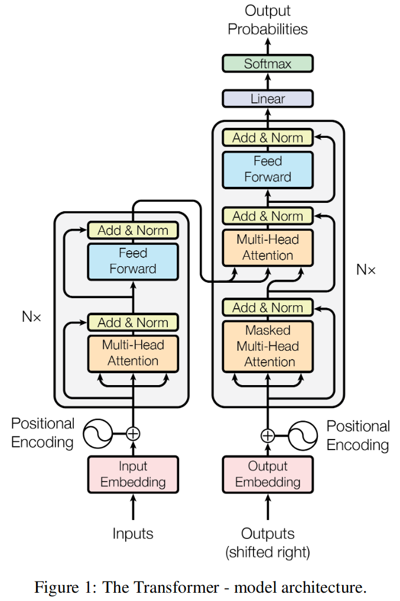

# Predicting Gene Ontology (GO) Aspects with Fine-Tuned Text Transformers

This repository presents the use of text definitions of GO terms to **fine-tune** a pre-trained Large Language Model (LLMs) based on the [transformer architecture](https://en.wikipedia.org/wiki/Transformer_(machine_learning_model)). The **goal** is to leverage this LLM to **categorize GO term definitions** based on their alignment with the major GO ontologies (BP, CC, and MF).

<figure><p align="center"></p></figure>

## Cloning the repository

```shell
(base)$ git clone https://github.com/matiollipt/GO-graph-definition-text-transformer.git
```

## Configuring the Conda Environment

- Creating the environment

```shell
(base)$: conda env create -f environment.yml
```

- Activating the environment

```shell
(base)$: conda activate go_tune
```

- Running the notebook

```shell
(go_tune)$: python -m jupyter main.ipynb
```

## Introduction

**Transformers** have gained significant attention in the Natural Language Processing (NLP) and machine learning landscape, contributing to the development of generative models like [chatGPT](https://chat.openai.com). Text transformer-based architectures are specifically engineered to analyze the dependencies between words (or *tokens*) in a text sequence, considering their positions to accuratelly capture the meaning of the text. This capability is instrumental in tasks such as text classification and ranking, as well as enabling generative models to generate new sentences in response to prompts.

The transformer architecture can be adapted and trained envisaging more specific applications, such as the [ProteinBERT](https://doi.org/10.1093/bioinformatics/btac020). ProteinBERT builds on top of the efficient transformer architecture, being trained over 106 millions of protein sequences from [UniProt](https://www.uniprot.org/) to capture protein semantics. The pre-trained model can be then fine-tuned to classify proteins into families, identify phylogenetic relationships, predict protein function and subcellular localization, protein-protein interactions, and much more...

## Automating Discovery In Life Sciences

High-throughput [DNA sequencing](https://en.wikipedia.org/wiki/DNA_sequencing#High-throughput_sequencing_(HTS)_methods) has give us the power to sequence the entire genome of a species within a day. With the sequence on hands, we can deploy **computational models to identify and annotate genes** based on their characteristics, attributing correct functions and subcellular locations of the gene product given the gene sequence.

For example, the [Critical Assessment of Protein Function Annotation (CAFA)](https://www.cell.com/trends/genetics/fulltext/S0168-9525(13)00166-2) competition engages the data science community in enhancing protein prediction by utilizing features derived from [Gene Ontology (GO)](https://geneontology.org/docs/ontology-documentation/).

## The Gene Ontology Graph

The Gene Ontology is represented as a **directed acyclic graph (DAG**) where **each node represents a specific GO term**. Each GO term defines a particular aspect of genes and their products. 

The GO terms are organized into three main categories: **Molecular Function (MF)**, **Cellular Component (CC)** and **Biological Process (BP)**:

- <font color="grey">***Molecular Function (MF)***</font>: These terms define the **activities** performed by gene products, such as *catalysis* or *transport*. These functions can be further refined by more specific GO terms, for example, "protein kinase activity" within the broader category of "catalysis".

- <font color="grey">***Cellular Component (CC)***</font>: These terms specify the subcellular **locations** of gene products, including compartments like *chloroplast* or *nucleus*, as well as macromolecular complexes like *proteasome* or *ribosome*.

- <font color="grey">***Biological Process (BP)***</font>: These terms delineate the biological **pathways** in which gene products are involved, ranging from 'DNA repair' and 'carbohydrate metabolic process' to overarching processes like *biosynthetic processes*.

The relationships between these terms are **hierarchical**, with **parent-child relationships** indicating broader and more specific terms, respectively. This hierarchical structure allows researchers to **annotate genes and gene products**, providing valuable information about their functions and roles in biological processes. For more information about how the GO graph is structured, please refer to my previous post [GO-graph-EDA](https://github.com/matiollipt/GO-graph-EDA) and the [Gene Ontology reference](https://geneontology.org/docs/ontology-documentation). For now, it is essential to know that **each node representing a GO term has specific attributes**.

## Extracting GO terms definitions: a glimpse on life mechanisms

A feature often overlooked when deploying the GO graph to assist in the prediction and classification of gene functions is the **textual definition of each GO term**. For example, the GO term ID [GO:0015986](https://www.ebi.ac.uk/QuickGO/term/GO:0015986) is defined as *"The transport of protons across the plasma membrane to generate an electrochemical gradient (proton-motive force) that powers ATP synthesis."*, along with other attributes shown below:

---
 **GO id**: GO:0015986

- **name**: 'proton motive force-driven plasma membrane ATP synthesis'
- **namespace**: 'biological_process'
- **def**: '"The transport of protons across the plasma membrane to generate an electrochemical gradient (proton-motive force) that powers ATP synthesis." [GOC:mtg_sensu, ISBN:0716731363]'
- **synonym**: ['"ATP synthesis coupled proton transport" BROAD []', '"plasma membrane ATP synthesis coupled proton transport" EXACT []']
 - **is_a**: ['GO:0015986']}

 ---
The nodes contain attributes describing the corresponding GO terms, and these are the essential ones that appear in every node:

 >***name***: unique identifier of the term in a human-readable format

>***namespace***: one of the three major ontologies (MF, CC or BP) to which the term belongs

>***definition***: a short description of what the GO term means for humans. It can also contains references to publications defining the term (e.g. PMID:10873824).

There are additional attributes of each node corresponding to GO terms, but we won't be using them in this project.

## Exercise

In this first simple exercise, we will use the text definitions of GO terms to **fine-tune** a pre-trained Large Language Model (LLMs) based on the [transformer architecture](https://en.wikipedia.org/wiki/Transformer_(machine_learning_model)). The **goal** is to leverage this LLM to **categorize GO term definitions** based on their alignment with the major GO ontologies (BP, CC, and MF).

>**Fine-tuning** is a powerful technique in machine learning that involves using models that have undergone **semi-supervised training** on extensive data from various sources. This process imparts the model with underlying semantic features of the language. After pre-training, the model is further trained in a **supervised manner** for a specific task, such as text generation, classification, or label prediction (for instance, identifying whether emails are spam or not). During this phase, the deeper encoded features of the pre-trained model are retained, but the trainable parameters of the output layer(s) are adjusted. For example, a feed-forward neural network can be added for binary classification of "spam" vs "not spam." These steps embody the concept of [Transfer Learning](https://machinelearningmastery.com/transfer-learning-for-deep-learning/), a powerful machine learning technique that involves applying knowledge learned from one task effectively to another task.

### Dataset Preparation

Our initial step involves pre-processing the dataset to make it compatible with the pre-trained model that we are going to fine-tune according to our needs. One model that fits our task requirements is the [bert-base-multilingual-uncased](https://huggingface.co/bert-base-multilingual-uncased), based on the well-known [Bidirectional Encoder Representations from Transformers (BERT)](https://huggingface.co/docs/transformers/model_doc/bert) architecture. This model has previously undergone **semi-supervised training** on an extensive dataset comprising millions of entries from [Wikipedia](https://www.wikipedia.org/) in 102 different languages. During this pre-training phase, the model learns language rules and dependencies, setting the stage for its application in various **supervised training** scenarios. These applications include tasks like sentiment analysis, text generation, text sequence classification, and, in our specific case, identifying the major GO ontology categories (BP, CC, and MF) for the given text sequences.

To prepare the dataset for fine-tuning our model, we will perform the following tasks:

1. **Feature Extraction**: In this step, we convert the attributes associated with each GO term's nodes into a Pandas DataFrame. This conversion streamlines the creation of pre-processed and tokenized datasets that will be used to train the model. We will focus on extracting only the text definitions and labels corresponding to the aspects we aim to predict (BP, MF, and CC).

2. **Dataset Creation and Splitting**: Our data will be divided into two subsets: a training set (80%) and an test set (20%). These sets will contain the input text derived from the definitions of GO terms.

3. **Text Tokenization**: The input text undergoes a tokenization process, breaking it into smaller units known as tokens. Special tokens are also incorporated to indicate the start and end of sequences and sentences. This step is crucial for enabling the model to comprehend the text.

To create and manage these datasets, we will make use of the [Dataset](https://huggingface.co/docs/datasets/index) library provided by Hugging Face. Additionally, as our project progresses, we will leverage pre-trained sequence classification models and their corresponding tokenizers, which are also available from [Hugging Face](https://huggingface.co/).

### Feature Extraction

The GO graph is stored in the *OBO (Open Biomedical Ontologies) file format*, designed specifically for the construction and representation of biological ontologies. To convert this file format into a **NetworkX** object, we can utilize the Python library [obonet](https://github.com/dhimmel/obonet). [NetworkX](https://networkx.org/) offers a robust framework for graph manipulation and analysis.

```python
from obonet import read_obo

go_graph = read_obo(home_dir.joinpath("data/go-basic.obo"))
```

The next task involves **extracting attributes from GO graph nodes and structuring them into a dataframe**. This process aims to facilitate the handling of text definitions. Additionally, we will include a column indicating the word count for each definition and visualize the distribution of these counts. This distribution will provide valuable insights for choosing optimal hyperparameters for tokenization (i.e., breaking the text into individual words or tokens) and fine-tuning our selected pre-trained model.

Looking at the sample GO term above, the *definition* ('*def*') is not purely textual. Here is the definition of the GO term **GO:0150058** as another example:

<font color="grey">'def': '<u>"A G protein-coupled receptor complex that serves as a receptor for amylin polypeptide (AMY) and consists of a calcitonin receptor (CTR/CALCR) and a receptor activity-modifying protein (RAMP) 3. Amylin receptor complex 3 (AMY3) also serves as a receptor for the amyloid-beta complex. Ligand binding to AMY3 results in increased cytosolic calcium ion levels and in activation on multiple intracellular signalling pathways."</u> [GOC:aruk, GOC:bc, PMID:22500019]'</font>

We intend to extract only the textual description from the definition to input the model during the fine-tuning step. Therefore, we need to split the text using appropriate separators and employ indexes to access the desired information. Note that the nodes' attributes are stored in a tuple where the first element is the **GO term ID**, and the second is a **dictionary containing the respective attributes**:

```
('GO:0000001', {'name': 'mitochondrion inheritance', 'namespace': 'biological_process', 'def': '"The distribution of mitochondria, including the mitochondrial genome, into daughter cells after mitosis or meiosis, mediated by interactions between mitochondria and the cytoskeleton." [GOC:mcc, PMID:10873824, PMID:11389764]', 'synonym': ['"mitochondrial inheritance" EXACT []'], 'is_a': ['GO:0048308', 'GO:0048311']})
```

```python
# create GO definitions dataframe

# create empty dataframe to store nodes' attributes
go_df = pd.DataFrame(
    columns=["go_id", "name", "aspect", "definition", "def_word_count"]
)

# iterate over nodes to extract dictionary keys and values
n_rows = len(go_graph.nodes)

for idx, item in tqdm(enumerate(go_graph.nodes.items()), total=n_rows):
    go_term = item[0]
    name = item[1]["name"]
    aspect = item[1]["namespace"]

    # split 'def' content and get the text definition only
    definition = item[1]["def"].split(sep='"', maxsplit=2)[1]

    # count the number of words of the text we just extracted
    def_word_count = len(re.findall(r"\w+", definition))

    go_df.loc[idx] = [
        go_term,
        name,
        aspect,
        definition,
        def_word_count,
    ]

# save dataframe
home_dir.joinpath("data/").mkdir(parents=True, exist_ok=True)
go_df.to_csv(home_dir.joinpath("data/go_df.csv"), index=False)

display(go_df.head())

```